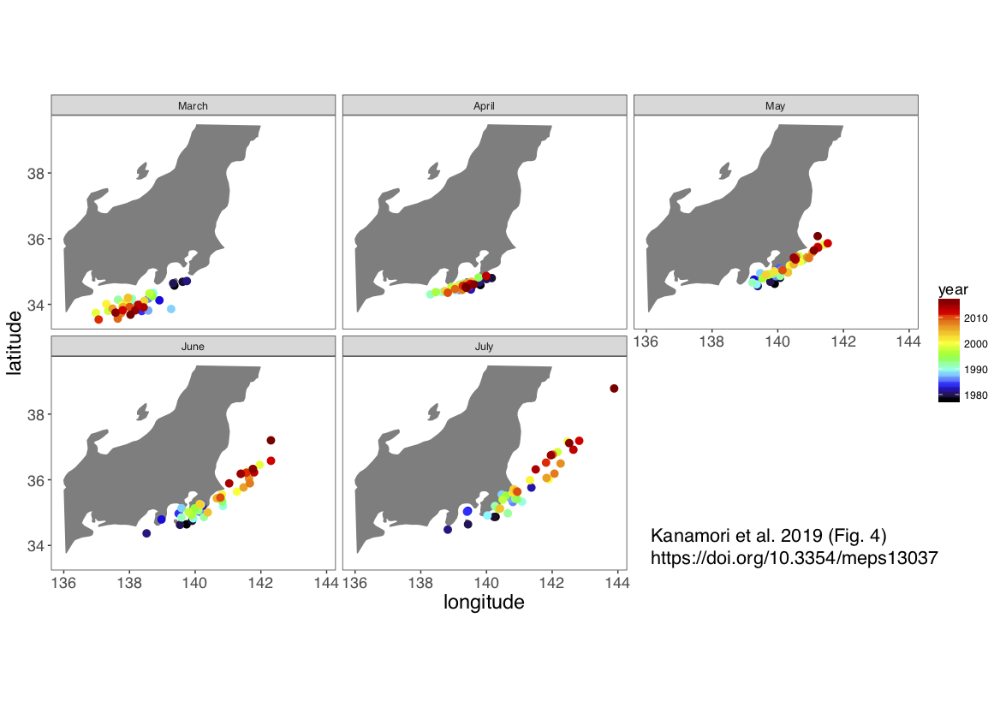
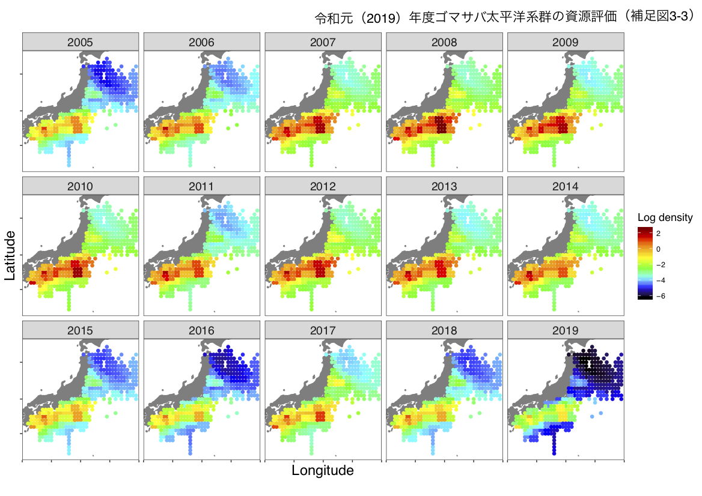
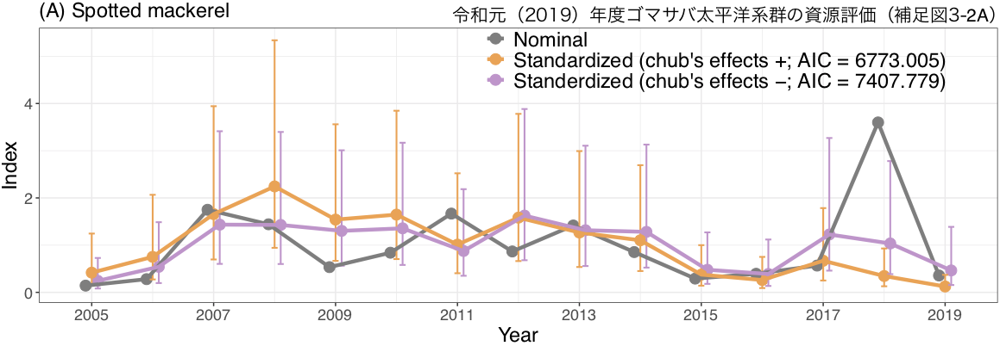

## `{ggvast}` とは
* `{VAST}`の推定結果を作図するためのパッケージ
* `{VAST}`では`{FishStatsUtils}`を用いて作図をしているが，以下のような不便な点がある
  * 後日，Save.RDataを使って作図をすることができない
  * `{VAST}`や`{FishStatsUtils}`が変更されると，これまでのコードで作図ができなくなることがある
  * 軸の名前が変更できない
    * 推定指標値の年トレンドでは，y軸名が必ずmetric tonnesになる
    * 推定密度のマップでは，NorthtingやEastingで表示される
  * 推定密度のマップとリジェンドが別々のファイルになる
  * COGの変化がkmで表示される    
* `{ggvast}`はこれらの問題を解決し，様々なハビタット，生物，研究分野で`{VAST}`を使いやすくすることを目標としている

## 注意点
* 予めVASTのコードを編集する必要があります
  ```
  Data_Geostat = cbind(Data_Geostat, knot_i = Spatial_List[["knot_i"]])
  ```

  ⬇︎

  ```
  Data_Geostat = cbind(Data_Geostat, knot_i = Spatial_List[["knot_i"]], zone = Extrapolation_List[["zone"]])
  write.csv(Data_Geostat, "Data_Geostat.csv")
  ```
* 複数種で解析する場合は[複数種の例題](https://github.com/James-Thorson-NOAA/VAST/blob/master/deprecated_examples/VAST--multispecies_example.Rmd)にならい，Data_Geostatの種に関する列名は **spp** として下さい
```
Data_Geostat = data.frame( "spp"=DF[,"Sci"], "Year"=DF[,"Year"], "Catch_KG"=DF[,"Wt"], "AreaSwept_km2"=0.01, "Vessel"=0, "Lat"=DF[,"Lat"], "Lon"=DF[,"Long"] )
```
```
TmbData = make_data("Version"=Version, "FieldConfig"=FieldConfig, "OverdispersionConfig"=OverdispersionConfig, "RhoConfig"=RhoConfig, "ObsModel"=ObsModel, "c_i"=as.numeric(Data_Geostat[,'spp'])-1, "b_i"=Data_Geostat[,'Catch_KG'], "a_i"=Data_Geostat[,'AreaSwept_km2'], "v_i"=as.numeric(Data_Geostat[,'Vessel'])-1, "s_i"=Data_Geostat[,'knot_i']-1, "t_i"=Data_Geostat[,'Year'], "spatial_list"=Spatial_List, "Options"=Options)
```

* 関数は書きあげましたが，パッケージ化に必要な種々のファイル（例えばDESCRIPTIONやマニュアル）の作成が間に合っておりません（パッケージ作りが初めてな上に一人で作っているので，作業スピードは亀です．．．）
* **パッケージ化までは，pre_Rフォルダ内のRコードをコピペして使ってください**
* `{ggvast}`に含まれる関数と関数から作成される図表は，『`{ggvast}` に含まれる関数』をご覧下さい
* ご意見ご要望がある場合にはissueまで

## 例題
* [VASTのコード](https://gist.github.com/Yuki-Kanamori/42d04d6235170f27e6d7dfce589722a2)    
    [VASTのマニュアル](https://github.com/James-Thorson-NOAA/VAST/blob/master/deprecated_examples/VAST--single-species_example.Rmd) をきちんと動くように修正したもの
* [作図コード](url)

## インストール方法
* 準備中

## `{ggvast}` に含まれる関数
* ### `map_cog()`   
  COGを地図上にプロットする．VASTの推定COGとノミナルデータ両方に対応．ノミナルデータのCOGをプロットする場合には，**`先にget_cog()`でCOGを計算する必要がある**

* #### `get_cog()`    
  ノミナルデータからCOGを計算し，データフレームを作成する
* `get_dens()`    
`Save.RData`から各knotごとの推定密度を抽出し，データフレームを作成する
* `map_dens()`    
  `get_dens()`で作成したデータフレームから推定密度のマップを作成する．VASTの推定密度とノミナルデータの両方に対応．

* `plot_index`    
  `{VAST}`から推定された指標値とノミナル指標値を一つの図にプロットする


## 参考資料
### vastのコード
* 複数のカテゴリーで解析した事例（masaVAST）
* catchability covariateに他種の密度，overdispersion configに年と月の交互作用を入れた事例（[gomasaVAST](https://github.com/Yuki-Kanamori/gomasaVAST)）
* 共変量に水温を入れた事例（masaVAST_NPFC2018）

### `{ggvast}`を使った論文・ドキュメント
* Kanamori Y, Takasuka A, Nishijima S, Okamura H (2019) Climate change shifts the spawning ground northward and extends the spawning period of chub mackerel in the western North Pacific. MEPS 624:155–166
https://doi.org/10.3354/meps13037
* Kanamori Y, Takasuka A, Nishijima S, Ichinokawa M, Okamura H (2019) Standardizing abundance index for spawning stock biomass of chub mackerel in the Northwest Pacific. NPFC-2018-TWG CMSA02-WP03
* 令和元 (2019) 年度ゴマサバ太平洋系群の資源評価    
http://abchan.fra.go.jp/digests2019/index.html （アップ待ち）


## 特記事項
**`{ggvast}`は業務外の時間にパッケージ開発について学び作成しているものであるため，水研業務とは無関係です**
