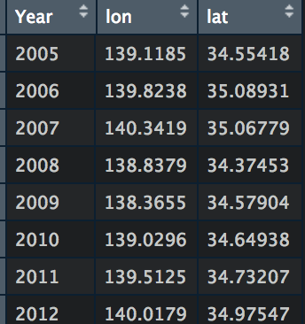
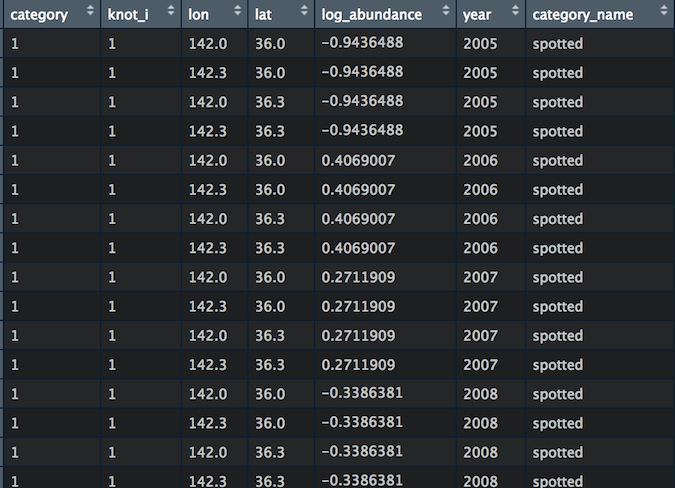

## ggvast とは
* VASTの推定結果を作図するためのパッケージ
* VASTではFishStatsUtilsを用いて作図をしているが，以下のような不便な点がある
  * 後日，Save.RDataを使って作図をすることができない
  * VASTやFishStatsUtilsが変更されると，これまでのコードで作図ができなくなることがある
  * 軸の名前が変更できない
    * 推定指標値の年トレンドでは，y軸名が必ずmetric tonnesになる
    * 推定密度のマップでは，NorthtingやEastingで表示される
  * 推定密度のマップとリジェンドが別々のファイルになる
  * COGの変化がkmで表示される    
* ggvast はこれらの問題を解決し，様々なハビタット，生物，研究分野でVASTを使いやすくすることを目標としている

## 注意点
* あらかじめVASTのコードを編集する必要がある
  ```
  Data_Geostat = cbind(Data_Geostat, knot_i = Spatial_List[["knot_i"]])
  ```

  ⬇︎

  ```
  Data_Geostat = cbind(Data_Geostat, knot_i = Spatial_List[["knot_i"]], zone = Extrapolation_List[["zone"]])
  write.csv(Data_Geostat, "Data_Geostat.csv")
  ```
* 複数種で解析する場合は[複数種の例題](https://github.com/James-Thorson-NOAA/VAST/blob/master/deprecated_examples/VAST--multispecies_example.Rmd)にならい，Data_Geostatの種に関する列名を**spp** とする
  ```
  Data_Geostat = data.frame( "spp"=DF[,"Sci"], "Year"=DF[,"Year"], "Catch_KG"=DF[,"Wt"], "AreaSwept_km2"=0.01, "Vessel"=0, "Lat"=DF[,"Lat"], "Lon"=DF[,"Long"] )
  ```


* ggvastの関数と関数から作成される図表は，『ggvastに含まれる関数』を参照
* ご意見ご要望はissueまで

## 例題
[vast_workshop2020](https://github.com/ShotaNishijima/vast_workshop2020/tree/master/ws用のスクリプトとデータ)
* ggvastのコードはpart2.R
* **VASTを動かした時，Data_Geostatなどを保存していないとggvastは使えない** 
* Thorsonのコードを使って解析している人は，pat1.Rを参考に修正する必要がある


## インストール方法
```
require(devtools)
install_github("Yuki-Kanamori/ggvast")
```
* インストールする際に色々なパッケージをアップデートするか聞かれるが，3(None)でよい

## ggvast に含まれる関数
* #### `map_cog()`   
  COGを地図上にプロットする．VASTの推定COGとノミナルデータ両方に対応．ノミナルデータのCOGをプロットする場合には，**先に`get_cog()`でCOGを計算する必要がある**
    
* #### `get_cog()`    
  ノミナルデータからCOGを計算し，データフレームを作成する    
    
* #### `get_dens()`    
  `Save.RData`から各knotごとの推定値を抽出し，データフレームを作成する
    
* #### `map_dens()`    
  アバンダンスを地図上にプロットする．VASTの推定値とノミナルデータの両方に対応．VASTの推定値をプロットする場合には，**先に`get_dens()`で`Save.RData`から推定値を抽出する必要がある**    
  **> 0データのみをプロットしたい場合には，> 0データのみのデータフレームを作成し関数にわたす**
  
* #### `plot_index()`    
  推定された指標値（`Table_for_SS3.csv`）とノミナル指標値を一つの図にプロットする．推定指標値が複数（つまりVASTの結果が複数）の場合も作図可能    
  

## 参考資料
### VASTのコード
* 複数のカテゴリーで解析した例（masaVAST）
* catchability covariateに他種の密度，overdispersion configに年と月の交互作用を入れた例（[gomasaVAST](https://github.com/Yuki-Kanamori/gomasaVAST)）
* 共変量に水温を入れた例（masaVAST_NPFC2018）
* catchability covariateに漁具を入れた例（chiVAST）

### ggvast を使った論文・ドキュメント
* Kanamori Y, Takasuka A, Nishijima S, Okamura H (2019) Climate change shifts the spawning ground northward and extends the spawning period of chub mackerel in the western North Pacific. MEPS 624:155–166
https://doi.org/10.3354/meps13037
* Kanamori Y, Takasuka A, Nishijima S, Ichinokawa M, Okamura H (2019) Standardizing abundance index for spawning stock biomass of chub mackerel in the Northwest Pacific. NPFC-2018-TWG CMSA02-WP03
* 令和元 (2019) 年度ゴマサバ太平洋系群の資源評価    
http://abchan.fra.go.jp/digests2019/index.html （アップ待ち）
